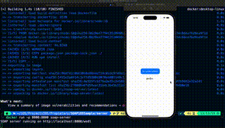

# Sample SOAP client-server sample
This repository contains a sample iOS SOAP client application. And a dockerized NodeJS SOAP simple server. This is the base code used in following posts [From Zero so SOAP](https://javios.eu/swift/harnessing-nfc-technology-in-your-ios-app/) 

## 🎥 Demo Video

### Check out the app in action!  
  

## Requirements

- **Xcode 15.0 or later**
- **iOS 16.0 or later**
- **Swift 6.0**

